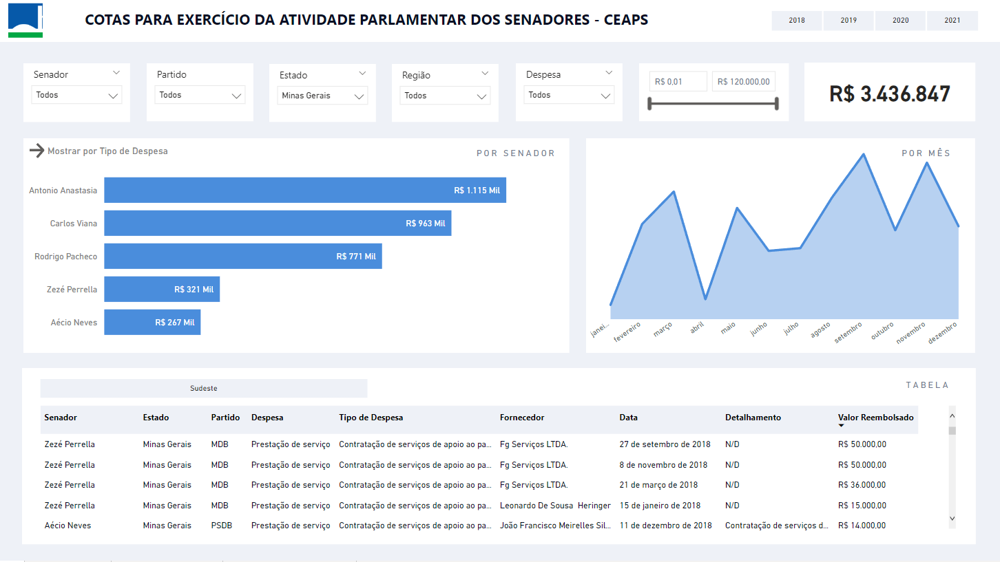
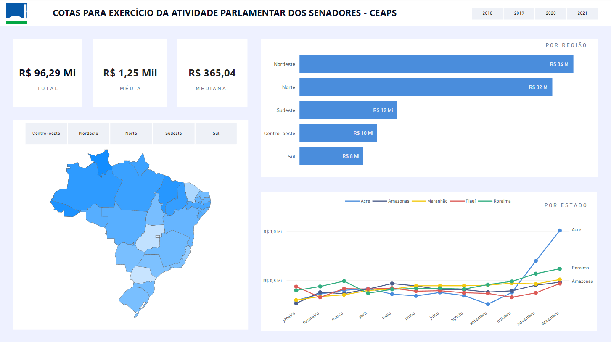
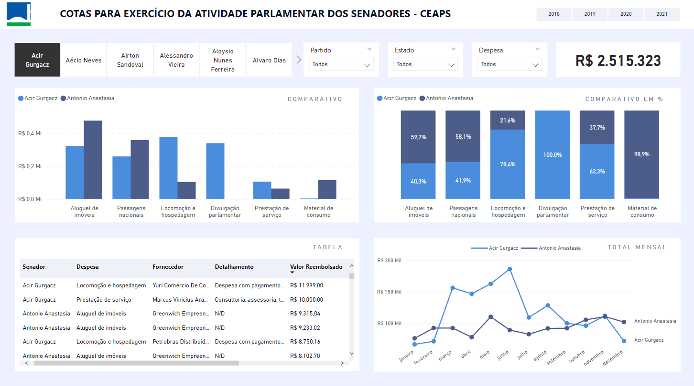

    

# Análise das Cotas para Exercício da Atividade Parlamentar dos Senadores

A Cota para o Exercício da Atividade Parlamentar dos Senadores (CEAPS) é uma cota mensal destinada a custear as despesas do mandato, como passagens aéreas e contas de celular. A despesa realizada pelo Senador ou Senadora é ressarcida pelo Senado Federal, mediante comprovação e até o valor limite mensal estabelecido no prazo de 90 dias. O dinheiro que financia esse benefício é público, ou seja, vem dos impostos que cada cidadão paga, portanto é necessário fiscalizar o seu uso. A regularização das cotas ocorreu justamente depois do escândalo “farra das passagens”, que revelou o mau uso do benefício existente pelos parlamentares. Todos nós podemos (e devemos!) observar o que tem sido gasto na atividade parlamentar.

Deste modo, este projeto tem o intuito de analisar as despesas dos senadores que atuaram entre 2018 e 2021 para obtermos uma ideia melhor de suas despesas e de como esta informação pode nos ajudar a fiscalizar os gastos dos senadores e possivelmente influenciar nossa decisão de voto para o ano de 2022.

## Tecnologias utilizadas:

* [Jupyter Notebook](https://jupyter.org/)
* [Python](https://www.python.org/)
* [Pandas](https://pandas.pydata.org/)
* [NumPy](https://numpy.org/)
* [Matplotlib](https://matplotlib.org/)
* [Power BI](https://pypi.org/project/gTTS/)

## Como rodar o projeto e fazer alterações:

1. Abra o projeto no Google Colab por [esse link](https://colab.research.google.com/github/ismailymendes/ceaps/blob/main/ceaps.ipynb)
2. Crie uma pasta chamada *data* e adicione os arquivos abaixo:  
   `despesa_ceaps_2018.csv`,  
   `despesa_ceaps_2019.csv`,  
   `despesa_ceaps_2020.csv`,  
   `despesa_ceaps_2021.csv`,  
   `lista_senadores_55leg.csv`,  
   `lista_senadores_56leg.csv`,  
   `dados_geograficos.csv`
4. Execute todas as células com ctrl+F9
5. Baixe o arquivo gerado despesa_ceaps_final.csv
6. Faça o download do Power BI por [este link](https://powerbi.microsoft.com/pt-br/downloads/) e importe o arquivo despesa_ceaps_final.csv
7. Na importação o Power BI realiza a transformação dos campos para os tipos corretos automaticamente, porém deve-se alterar o tipo do campo "Valor Reembolsado"
8. Clique em ***Transformar Dados***, apague o valor ***{"Valor Reembolsado", Int64.Type}***, clique com o botão direito no campo ***Valor Reembolsado***, ***Alterar tipo*** ***utilizando a localidade*** e selecione ***Número decimal*** e ***Inglês (Estados Unidos)***
9.  Ou se preferir execute o arquivo ceaps_dashboard.pbix para visualizar o dashboard já montado

## Dashboard:

